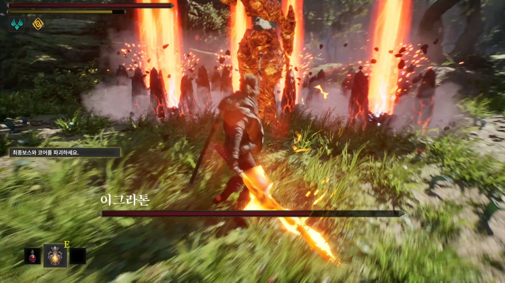
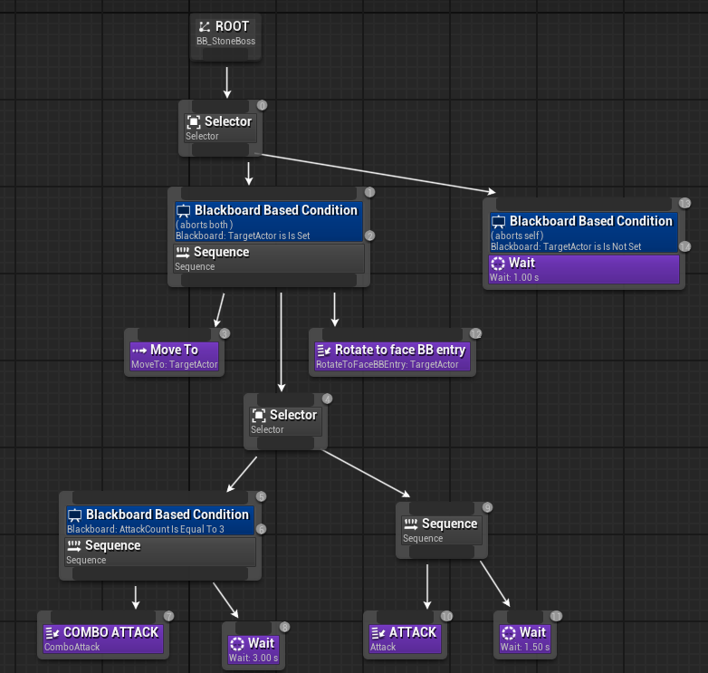
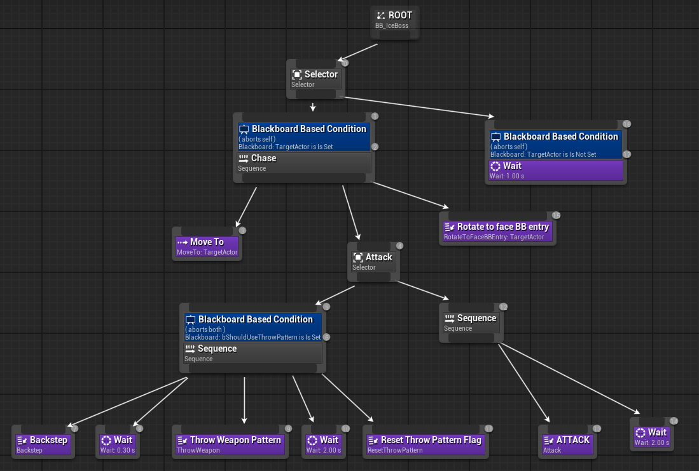

# Re:Season

Unreal Engine 5로 제작한 3인 팀 프로젝트입니다. 팀장과 클라이언트 개발을 맡았으며, 보스 전투 패턴과 Behavior Tree 기반 AI 구현을 담당했습니다.

## Project Overview

| 항목 | 내용 |
| --- | --- |
| Genre | 3D Action Roguelike |
| Engine | Unreal Engine 5 |
| Language | C++ |
| Team | 3명 |
| Period | 2025.08 ~ 2025.12 |
| Role | 팀장 / 클라이언트 개발 / 보스 전투 패턴 및 AI |
| Collaboration | Perforce |

## My Contribution

- 보스 전투 패턴 구현
- Behavior Tree 기반 보스 AI 구성
- AI Perception / Blackboard Target 관리
- AnimNotifyState 기반 공격 판정 구간 제어
- WeaponTip Sphere Sweep 및 동일 스윙 중복 타격 방지
- Stone / Ice Boss 특수 패턴 구현

플레이어 전투 시스템은 다른 팀원이 담당했습니다.

## Key Implementations

### Weapon Sweep

AnimNotifyState로 지정한 공격 유효 구간 동안 이전 WeaponTip과 현재 WeaponTip 사이를 Sphere Sweep합니다. 동일 스윙에서 감지된 Actor는 `TSet`으로 관리해 중복 피해를 방지합니다.

### Boss AI

AI Perception으로 감지한 Actor를 Blackboard의 `TargetActor`에 저장합니다. Behavior Tree에서는 Unreal 기본 `MoveTo`·`RotateToFaceBBEntry` Node와 Custom C++ 공격·특수 패턴 Task를 조합합니다.

### Stone Boss

일반 공격 Montage의 `DealDamage` Notify가 3회 누적되면 `AttackCount == 3` 조건에서 지진 Combo Sequence를 우선 실행합니다. Combo Montage의 AnimNotify가 `EarthquakeZone` 생성 시점을 결정합니다.

### Ice Boss

HP가 50% 이하가 되는 최초 1회 Blackboard Flag를 통해 Backstep → Throw → Reset Sequence를 실행합니다. Throw Task는 Timer를 이용해 3~5회의 `ThrowWeapon` 호출을 수행합니다.

## Code Guide

| 구현 | 주요 Source |
| --- | --- |
| Weapon Sweep | [BossCharacter.cpp](Source/ReSeason/Private/BossCharacter.cpp) |
| Weapon Trace Window | [Notify_WeaponTraceState.cpp](Source/ReSeason/Private/Notify_WeaponTraceState.cpp) |
| Boss AI | [BossAIController.cpp](Source/ReSeason/Private/BossAIController.cpp) |
| Basic Attack Task | [BTTask_Attack.cpp](Source/ReSeason/Private/BTTask_Attack.cpp) |
| Stone Boss | [StoneBossCharacter.cpp](Source/ReSeason/Private/StoneBossCharacter.cpp) |
| Stone Combo | [BTTask_ComboAttack.cpp](Source/ReSeason/Private/BTTask_ComboAttack.cpp) |
| Earthquake Spawn | [AN_SpawnEarthquake.cpp](Source/ReSeason/Private/AN_SpawnEarthquake.cpp) |
| Earthquake Damage | [EarthquakeZone.cpp](Source/ReSeason/Private/EarthquakeZone.cpp) |
| Ice Boss | [IceBossCharacter.cpp](Source/ReSeason/Private/IceBossCharacter.cpp) |
| Ice Backstep | [BTTask_Backstep.cpp](Source/ReSeason/Private/BTTask_Backstep.cpp) |
| Ice Throw | [BTTask_ThrowWeapon.cpp](Source/ReSeason/Private/BTTask_ThrowWeapon.cpp) |
| Ice Pattern Reset | [BTTask_ResetThrowPattern.cpp](Source/ReSeason/Private/BTTask_ResetThrowPattern.cpp) |

## Repository Scope

- 3인 팀 프로젝트에서 포트폴리오 검토를 위해 선별한 Source Code Showcase입니다.
- 대표 구현 사례를 중심으로 선별했으며, 프로젝트에 구현된 모든 보스 코드를 포함하지는 않았습니다.
- 보스 전투와 보스 AI 관련 C++ Source 24개만 포함합니다.
- 실행 가능한 전체 Unreal Engine 프로젝트가 아니며, 일부 공용 Interface와 Asset 의존성이 제외되어 Build할 수 없습니다.
- Marketplace·Third-party Asset과 Binary Asset(`.uasset`, `.umap`)을 포함하지 않습니다.
- 플레이어 전투 시스템 구현 파일은 제외했으며, 일부 공용 코드의 플레이어·Katana 참조는 원본 형태로 남아 있습니다.
